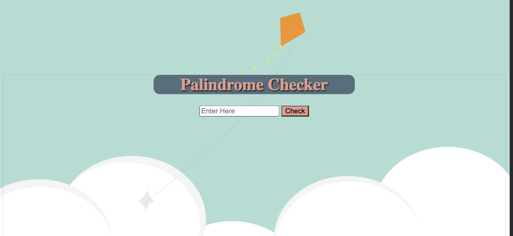

# ↔️ Server Side Palindrome Checker

### Goal: Create a simple web application that uses the fs and http modules to validate if a string is a palindrome server side.

## How It's Made:

**Tech used:** HTML, CSS, JavaScript, Framework of choice

## Lessons Learned:
In order to create the palindrome checker applicatdion, the methods used were: .split() .reverse() and .join(). I also used an API to to call the methods on the input value. 
